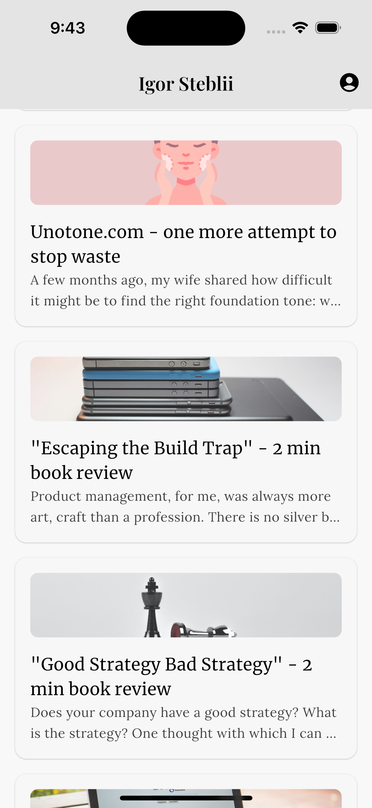

# Flutter Bloc Kit

## Demo 

The demo app uses [igorsteblii.com](igorsteblii.com) Jekyll-based blog as an API source to feature articles and an About page.

| Home | Story | About |
|--------|--------|--------|
|  |  |  |

## Setup 

### Flutter Version Manager 

 * Install `fvm` [Flutter Version Manager](https://fvm.app/documentation/getting-started) with `brew`
 * Check Flutter version from [.fvmrc](.fvmrc)
 * Install Flutter: `fvm use x.y.z`


## Run

### Debug

Run on any device/emulator from the terminal
* `fvm flutter run`

### Release

Options to release the app:

#### Android 

 * `Preferred:` For App Store release  
    * fvm flutter build appbundle --release
 * Fat APK with all ABI
   * fvm flutter build apk --release   
 * For split-abi APK testing 
    * fvm flutter build apk --release --split-per-abi  

#### iOS 

 * Archive for App store upload 
    * fvm flutter build ipa --release
    * open file with Xcode, validate and upload

## Greenfield

A simple way to create a new screen, copy folder [_greenfield](lib/screens/_greenfield) and rename all instances:

   *  files names from `greenfield_` to new name
   *  All instances of `greenfield` and `Greenfield` in files


## Plugins

### Architecture

See [BLoC](https://bloclibrary.dev/)

### Localisation 

1. Add new localisation in [l10n](lib/l10n/app_en.arb)
2. Run `fvm flutter gen-l10n` or rebuild the app

### Database

Isar DB

* To regenerate classes `fvm flutter pub run build_runner build`
* New entity add `part '[file name].g.dart';`

### Launcher Icon

See more [here](https://pub.dev/packages/flutter_launcher_icons)

```
flutter pub get
dart run flutter_launcher_icons
```

## Tools 

Useful tools

### VSCode Plugins

Name: [File Header Comment](https://marketplace.visualstudio.com/items?itemName=doi.fileheadercomment)

## Git

### Tags

Each release needs to be tagged according to the version from [pubspec](pubspec.yaml)

   * Example: `version: 0.9.23+23`
   * Git: `git tag -a v0.9.23 -m "Release version 0.9.23"` & `git push --tags`
   * Version naming `[MAJOR][MINOR][PATCH]`
   * See all tags: `git tag -n` 

### MR Naming 

MR naming: `[TYPE][TICKET]` 

Types:

   * `[FEAT]` - feature developmet
   * `[FIX]` - bug fixing 
   * `[CHORE]` - refactoring
   * `[TEST]` -  UI/UT tests

### Branch naming 

Branch naming: `type/ticket`

* `feat` - feature developmet
* `fix` - bug fixing 
* `chore` - refactoring
* `test` -  UI/UT tests

## Podcast 

Learn about this project from Podcast generated by [gitpodcast.com](gitpodcast.com)

<audio controls src="demo/Fluter Block Kit Porcast from gitpodcast.com.mp3" title="Fluter Block Kit Porcast"></audio>

https://github.com/user-attachments/assets/5255a6a1-8274-462b-b767-723aea092ce2

## Author

Email: me@igorsteblii.com
